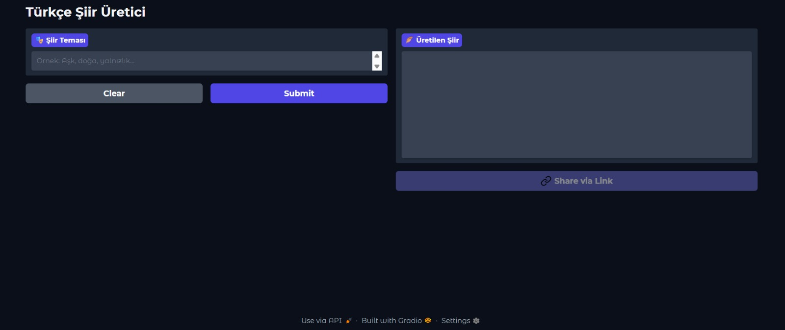
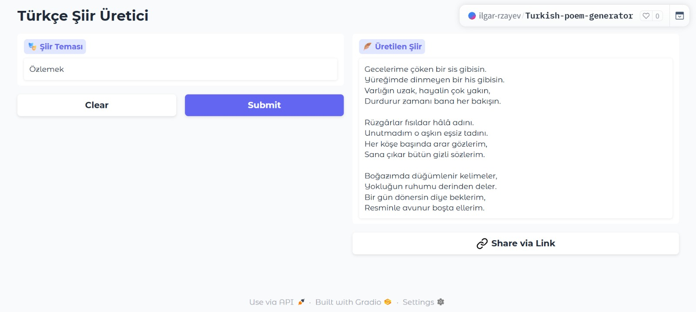
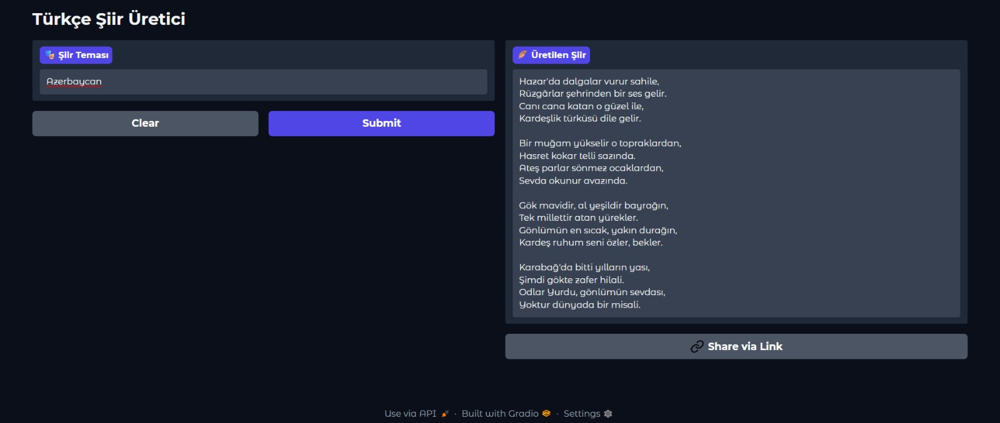
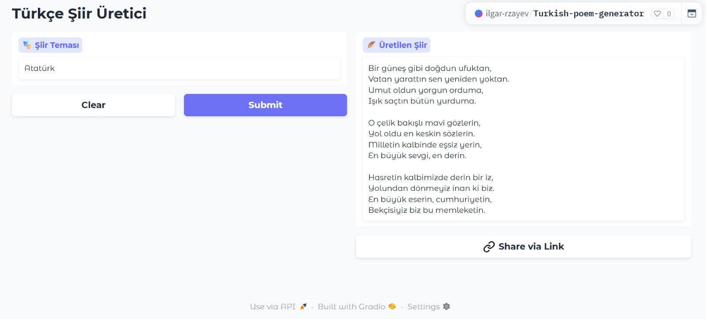

# 🎭 Türkçe Şiir Üretici - RAG Tabanlı AI Asistanı

  


  


  

**Kullanıcının girdiği temaya göre özgün Türkçe şiirler üreten yapay zeka asistanı**

  

  

</div>

  

## 🎯 Proje Amacı

  

Bu proje, **Retrieval Augmented Generation (RAG)** mimarisi kullanarak, kullanıcıların belirlediği temalara uygun orijinal Türkçe şiirler üreten bir yapay zeka asistanıdır. Geleneksel Türk şiirinden öğrenerek yeni ve yaratıcı şiirler oluşturur.

  

---

  

## 🌟 Özellikler

  

-  **Tema Tabanlı Şiir Üretimi**: Kullanıcının girdiği her temaya uygun şiirler

-  **Türk Edebiyatı Bilgisi**: 19.000+ şiirden oluşan veri seti

-  **Akıllı AI Modeli**: Google Gemini Flash Latest ile gelişmiş metin üretimi

-  **Hızlı Arama**: FAISS ile anında benzer şiir bulma

-  **Kafiye ve Ahenk**: Otomatik kafiye ve şiirsel yapı oluşturma

-  **Kullanıcı Dostu Arayüz**: Gradio ile modern web arayüzü

  

---

  
## 🧠 Mimarisi


### Çözülen Problemler

-   **Yaratıcı Metin Üretimi**: Geleneksel dil modellerinin tekrara düşme eğilimini, gerçek şiir verisiyle zenginleştirilmiş RAG mimarisi ile aşar.
    
-   **Türkçe Doğal Dil İşleme**: Multilingual embedding modeli sayesinde Türkçe metinler etkili bir şekilde işlenir.
    
-   **Hızlı ve Etkili Arama**: FAISS ile büyük veri setlerinde benzerlik araması hızlıca yapılır.
    


## 🛠️ Teknolojiler


<table border="1" cellpadding="10" cellspacing="0" style="border-collapse: collapse; width: 100%;">
  <thead style="background-color: #f8f9fa;">
    <tr>
      <th>Kategori</th>
      <th>Teknoloji</th>
      <th>Açıklama</th>
    </tr>
  </thead>
  <tbody>
    <tr>
      <td><strong> AI Model</strong></td>
      <td>Google Gemini Flash Latest</td>
      <td>Şiir üretimi için ana LLM</td>
    </tr>
    <tr style="background-color: #f8f9fa;">
      <td><strong> Embedding</strong></td>
      <td>Multilingual MiniLM</td>
      <td>Metin vektörleştirme</td>
    </tr>
    <tr>
      <td><strong> Vector DB</strong></td>
      <td>FAISS</td>
      <td>Benzerlik arama motoru</td>
    </tr>
    <tr style="background-color: #f8f9fa;">
      <td><strong> Framework</strong></td>
      <td>LangChain</td>
      <td>RAG pipeline yönetimi</td>
    </tr>
    <tr>
      <td><strong> Web UI</strong></td>
      <td>Gradio</td>
      <td>Kullanıcı arayüzü</td>
    </tr>
    <tr style="background-color: #f8f9fa;">
      <td><strong> Programlama</strong></td>
      <td>Python</td>
      <td>Ana programlama dili</td>
    </tr>
    <tr>
      <td><strong> Veri Seti</strong></td>
      <td>Hugging Face</td>
      <td>Türkçe şiir koleksiyonu</td>
    </tr>
    <tr style="background-color: #f8f9fa;">
      <td><strong> API</strong></td>
      <td>Google Generative AI</td>
      <td>Gemini API erişimi</td>
    </tr>
  </tbody>
</table>

</div>
  
 ### 🔁 Mimari Akış Diyagramı 
 Kullanıcı Girdisi (Tema) → Gradio Arayüzü → ConversationalRetrievalChain (LangChain) → FAISS Vektör Arama → Şiir Veritabanı (Embedding) → Google Gemini Flash Latest → Üretilen Şiir → Kullanıcı

---

  

## 📊 Veri Seti

  

### 📖 Veri Kaynağı

-  **Platform**: Hugging Face Datasets

-  **Veri Seti**: `aliarda/Turkish-Poems-19K`

-  **İçerik**: 19.026 adet Türkçe şiir

-  **Kullanım**: Projede ilk 1.000 şiir işleme alınmıştır

  

## 🚀 Çalışma Kılavuzu

### 📋 Ön Koşullar
- Python 3.8+
- Google Gemini API anahtarı
- Hugging Face token

---

### Local Ortamda Çalıştırma Adımları

 1. Repository'yi Klonla
```bash
git clone https://github.com/IlgarRzayev/rag_based_chatbot.git
cd rag_based_chatbot
```

2. Sanal ortam oluştur ve çalıştır
```bash
python -m venv venv
source venv/bin/activate  # Linux/Mac
venv\Scripts\activate     # Windows
```

  3. Gerekli kütüphaneleri yükle
```bash
pip install -r requirements.txt
```

  4. `.env` dosyası oluştur ve API anahtarlarını ekle
```bash
echo  GOOGLE_API_KEY="your_api_key"  > .env 
echo  HF_TOKEN="your_huggingface_token"  >> .env
```


 5. Uygulamayı başlat
```bash
python app.py
```
  6. Tarayıcınızda `http://127.0.0.1:7860` adresine gidin


###  Colab Ortamında Çalıştırma Adımları

1.  Tarayıcıdan https://colab.research.google.com adresine gidin.

2. Açılan pencerede yan sekmeden **“GitHub”**’a tıklayın

3. Arama kutusuna ```IlgarRzayev/rag_based_chatbot``` GitHub repo linkini yazın:
 
4. ```rag_based_project.ipynb``` dosyasını seçin

5.  Gizli Anahtarları Ekleyin (Secrets)
    

-   Colab menüsünden **“🔑 Secrets”** veya **“Environment Variables”** kısmına gidin
    
-   Aşağıdaki iki anahtarı ekleyin:
    
    -   `GOOGLE_API_KEY` → Gemini API anahtarınız
        
    -   `HF_TOKEN` → Hugging Face token’ınız

 5.   Tüm Hücreleri Çalıştırın  

Üst menüden **Runtime → Run all (Tümünü Çalıştır)** seçeneğini seçin.


## 💻 Web Uygulaması

🔗 **Canlı Demo:** https://huggingface.co/spaces/ilgar-rzayev/Turkish-poem-generator

Proje, **Gradio** arayüzü üzerinden çalışmaktadır.  
Kullanıcı, metin kutusuna bir **tema** (örneğin _aşk, ayrılık, doğa_) yazar ve **"Submit"** butonuna bastığında sistem, o temaya uygun  Türkçe şiir üretir.

### 📸 Örnek Görseller

Uygulama çalışınca çıkan arayüz:


Örnek 1:


Örnek 2:


Örnek 3:



## 📁 Proje Yapısı

```bash
rag_based_chatbot/
├── images/                      
│   ├── image1.jpeg
│   ├── image2.jpeg
│   ├── image3.jpeg
│   └── image4.jpeg
├── rag_based_project.ipynb      
├── app.py
├── requirements.txt             
├── README.md
├── .gitignore                    

```


## 📞 İletişim
Proje hakkında sorunuz varsa iletişime geçebilirsiniz.

-   GitHub: https://github.com/IlgarRzayev
-   Linkedin: https://www.linkedin.com/in/ilgar-rzayev-96996022a/

